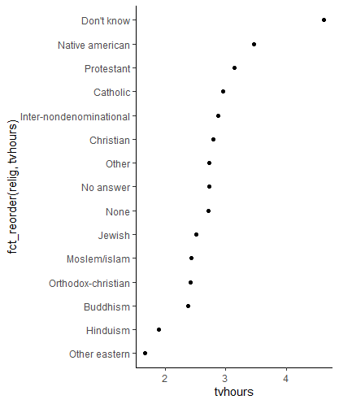

# forcats

## Factors

`read.csv()`函数的默认操作会把输入文件的字符型列自动转换成因子， 这对于性别、职业、地名这样的列是合适的， 但是对于姓名、日期、详细地址这样的列则不合适。 所以，在`read.csv()`调用中经常加选项`stringsAsFactors=FALSE`选项禁止这样的自动转换，还可以用`colClasses`选项逐个指定每列的类型。

```
xf <- factor(x, levels = c("Male", "Man" , "Lady",   "Female"),
                 labels = c("Male", "Male", "Female", "Female"))
```

|                            |                                                                                                                           |
| -------------------------- | ------------------------------------------------------------------------------------------------------------------------- |
| table( )                   | 统计因子各水平的出现次数（称为频数或频率）                                                                                                     |
| margin.table()             | <p>margin frequencies</p><p></p><p>margin.table(mytable, 1) </p><p>margin.table(mytable, 2) </p>                          |
| prop.table()               | <p>relative frequencies<br><br>mytable &#x3C;- table(A,B)</p><p>prop.table(mytable , 1)</p><p>prop.table(mytable , 2)</p> |
| <p>ftable</p><p>xtable</p> | <p>3-Way Frequency Table</p><p></p><p>mytable &#x3C;- table(A, B, C) <br>ftable(mytable)</p>                              |
|                            |                                                                                                                           |
| tapply( )                  | <p>按照因子分组然后每组计算另一变量的概括统计</p><p>tapply(h, sex, mean)</p>                                                                   |
| library(forcats)           | <p>forcats包的因子函数 <br>分类变量类数较多时，往往需要对因子水平另外排序、合并</p>                                                                       |
| structable                 | 结构化列联表                                                                                                                    |

```
library(vcd)
data(Titanic)
structable(Sex+Age ~ Class+Survived, data = Titanic)

               Sex  Male       Female      
               Age Child Adult  Child Adult
Class Survived                             
1st   No               0   118      0     4
      Yes              5    57      1   140
2nd   No               0   154      0    13
      Yes             11    14     13    80
3rd   No              35   387     17    89
      Yes             13    75     14    76
Crew  No               0   670      0     3
      Yes              0   192      0    20
```

## Package forcats

### Functions

|                                                                          |                                                              |
| ------------------------------------------------------------------------ | ------------------------------------------------------------ |
| [as_factor](https://rdrr.io/cran/forcats/man/as_factor.html)             | Convert input to a factor                                    |
| [fct_anon](https://rdrr.io/cran/forcats/man/fct_anon.html)               | Anonymise factor levels                                      |
| [fct_c](https://rdrr.io/cran/forcats/man/fct_c.html)                     | Concatenate factors, combining levels                        |
| [fct_collapse](https://rdrr.io/cran/forcats/man/fct_collapse.html)       | Collapse factor levels into manually defined groups          |
| [fct_count](https://rdrr.io/cran/forcats/man/fct_count.html)             | Count entries in a factor                                    |
| [fct_cross](https://rdrr.io/cran/forcats/man/fct_cross.html)             | Combine levels from two or more factors to create a new...   |
| [fct_drop](https://rdrr.io/cran/forcats/man/fct_drop.html)               | Drop unused levels                                           |
| [fct_expand](https://rdrr.io/cran/forcats/man/fct_expand.html)           | Add additional levels to a factor                            |
| [fct_explicit_na](https://rdrr.io/cran/forcats/man/fct_explicit_na.html) | Make missing values explicit                                 |
| [fct_inorder](https://rdrr.io/cran/forcats/man/fct_inorder.html)         | Reorder factor levels by first appearance, frequency, or...  |
| [fct_lump](https://rdrr.io/cran/forcats/man/fct_lump.html)               | 将因子级别汇总到“其他”中                                                |
| [fct_match](https://rdrr.io/cran/forcats/man/fct_match.html)             | Test for presence of levels in a factor                      |
| [fct_other](https://rdrr.io/cran/forcats/man/fct_other.html)             | Replace levels with "other"                                  |
| [fct_recode](https://rdrr.io/cran/forcats/man/fct_recode.html)           | Change factor levels by hand                                 |
| [fct_relabel](https://rdrr.io/cran/forcats/man/fct_relabel.html)         | Automatically relabel factor levels, collapse as necessary   |
| [fct_relevel](https://rdrr.io/cran/forcats/man/fct_relevel.html)         | Reorder factor levels by hand                                |
| [fct_reorder](https://rdrr.io/cran/forcats/man/fct_reorder.html)         | Reorder factor levels by sorting along another variable      |
| [fct_rev](https://rdrr.io/cran/forcats/man/fct_rev.html)                 | Reverse order of factor levels                               |
| [fct_shift](https://rdrr.io/cran/forcats/man/fct_shift.html)             | Shift factor levels to left or right, wrapping around at end |
| [fct_shuffle](https://rdrr.io/cran/forcats/man/fct_shuffle.html)         | 随机置换因子水平                                                     |
| [fct_unify](https://rdrr.io/cran/forcats/man/fct_unify.html)             | Unify the levels in a list of factors                        |
| [fct_unique](https://rdrr.io/cran/forcats/man/fct_unique.html)           | Unique values of a factor                                    |
| [forcats-package](https://rdrr.io/cran/forcats/man/forcats-package.html) | forcats: Tools for Working with Categorical Variables...     |
| [gss_cat](https://rdrr.io/cran/forcats/man/gss_cat.html)                 | A sample of categorical variables from the General Social... |
| [lvls](https://rdrr.io/cran/forcats/man/lvls.html)                       | Low-level functions for manipulating levels                  |
| [lvls_union](https://rdrr.io/cran/forcats/man/lvls_union.html)           | Find all levels in a list of factors                         |


 

 `fct_recode()`在修改水平名时允许多个旧水平对应到一个新水平， 从而合并原来的水平。 如果合并很多， 可以用`fct_collapse()`函数

### Relevel

`fct_relevel()`第一个参数是要修改次序的因子， 后续可以有多个字符型参数表示要提前的水平。

```
gss_cat %>%
  count(rincome)
## 随机置换因子水平
reshuffled_income <- gss_cat$rincome %>%
  fct_shuffle()
fct_relevel(reshuffled_income, c("Lt $1000", "$1000 to 2999")) %>%
  levels()
```

### Reordering by another variable

`fct_reorder()`可以根据不同因子水平分成的组中另一数值型变量的统计量值排序。

```
library(tidyverse)
library(forcats)
relig_summary <- gss_cat %>%
  group_by(relig) %>%
  summarise(
    age = mean(age, na.rm = TRUE),
    tvhours = mean(tvhours, na.rm = TRUE),
    n = n()
  )

ggplot(relig_summary, aes(tvhours, relig)) + geom_point()
ggplot(relig_summary, aes(tvhours, fct_reorder(relig, tvhours))) +
  geom_point()
```



### Ordering by frequency

```
library(dplyr)
library(ggplot2)
library(forcats)
ggplot(starwars, aes(x = fct_infreq(hair_color))) + 
  geom_bar() + 
  coord_flip()
```

.png>)

### Combining levels

* 正n保留最常见的n值。 负数n保留最不常用的-n值。
* Prop: Positive prop lumps values which do not appear at least prop of the time. Negative prop lumps values that do not appear at most -prop of the time.

```
starwars %>%
  count(skin_color, sort = TRUE)

starwars %>%
  mutate(skin_color = fct_lump(skin_color, n = 5)) %>%
  count(skin_color, sort = TRUE)
#> # A tibble: 6 x 2
#>   skin_color     n
#>   <fct>      <int>
#> 1 Other         41
#> 2 fair          17
#> 3 light         11
#> 4 dark           6
#> 5 green          6
#> 6 grey           6


starwars %>%
  mutate(skin_color = fct_lump(skin_color, prop = .1)) %>%
  count(skin_color, sort = TRUE)
#> # A tibble: 3 x 2
#>   skin_color     n
#>   <fct>      <int>
#> 1 Other         59
#> 2 fair          17
#> 3 light         11


starwars %>%
  mutate(skin_color = fct_lump(skin_color, prop = .1, other_level = "extra")) %>%
  count(skin_color, sort = TRUE)
#> # A tibble: 3 x 2
#>   skin_color     n
#>   <fct>      <int>
#> 1 extra         59
#> 2 fair          17
#> 3 light         11


```
