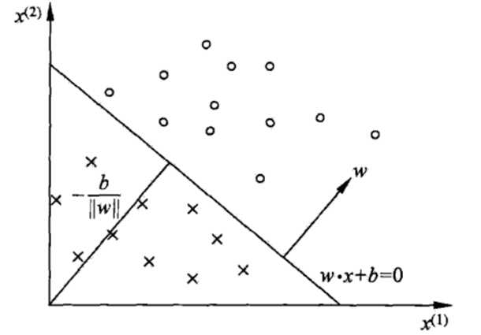

# Deep Neural Networks

## Set up

### Perceptron (感知器模型)

我们在一个平台上有很多的男孩女孩，感知机的模型就是尝试找到一条直线，能够把所有的男孩和女孩隔离开。放到三维空间或者更高维的空间，感知机的模型就是尝试找到一个超平面，能够把所有的二元类别隔离开。使用感知机一个最大的前提，就是数据是线性可分的。这严重限制了感知机的使用场景。它的分类竞争对手在面对不可分的情况时，比如支持向量机可以通过核技巧来让数据在高维可分，神经网络可以通过激活函数和增加隐藏层来让数据可分。

用数学的语言来说，如果我们有m个样本，每个样本对应于n维特征和一个二元类别输出，如下：

$$
(x_1^{(0)}, x_2^{(0)}, ...x_n^{(0)}, y_0), (x_1^{(1)}, x_2^{(1)}, ...x_n^{(1)},y_1), ... (x_1^{(m)}, x_2^{(m)}, ...x_n^{(m)}, y_m)
$$

我们的目标是找到这样一个超平面，即：

$$
\theta_0 + \theta_{1}x_1 + ... + \theta_{n}x_{n} = 0
$$

让其中一种类别的样本都满足 $$\theta_0 + \theta_{1}x_1 + ... + \theta_{n}x_{n} > 0$$ ，让另一种类别的样本都满足$$\theta_0 + \theta_{1}x_1 + ... + \theta_{n}x_{n} < 0$$，从而得到线性可分。如果数据线性可分，这样的超平面一般都不是唯一的，也就是说感知机模型可以有多个解。

即对于这个分离的超平面，我们定义为$$w^Tx + b = 0$$。在超平面$$w^Tx + b = 0$$上方的我们定义为𝑦=1 y = 1 ,在超平面$$w^Tx + b = 0$$下方的我们定义为𝑦=−1 y = − 1 。

### 从感知机到神经网络

感知机的模型，它是一个有若干输入和一个输出的模型, 输出和输入之间学习到一个线性关系，得到中间输出结果：

$$
z=\sum\limits_{i=1}^mw_ix_i + b
$$

**感知机的神经元激活函数**, 

得到我们想要的输出结果1或者-1。这个模型只能用于二元分类，且无法学习比较复杂的非线性模型，因此在工业界无法使用。

$$
sign(z)= \begin{cases} -1& {z<0}\\ 1& {z\geq 0} \end{cases}
$$

#### 神经网络则在感知机的模型上做了扩展

1. 加入了隐藏层，隐藏层可以有多层，增强模型的表达能力，[如图实例](https://www.cnblogs.com/pinard/p/6418668.html)，当然增加了这么多隐藏层模型的复杂度也增加了好多
2. 输出层的神经元也可以不止一个输出，可以有多个输出，这样模型可以灵活的应用于分类回归
3.  对激活函数做扩展, 神经网络中一般使用的其他的激活函数，比如我们在逻辑回归里面使用过的Sigmoid函数，即：

    $$
    f(z)=\frac{1}{1+e^{-z}}
    $$

### DNN的基本结构

DNN可以理解为有很多隐藏层的神经网络。这个很多其实也没有什么度量标准, 多层神经网络和深度神经网络DNN其实也是指的一个东西，当然，DNN有时也叫做多层感知机（Multi-Layer perceptron,MLP）

从DNN按不同层的位置划分，[DNN内部的神经网络层](https://julien-vitay.net/deeprl/DeepLearning.html)可以分为三类，输入层，隐藏层和输出层, 一般来说第一层是输入层，最后一层是输出层，而中间的层数都是隐藏层。层与层之间是全连接的，也就是说，第i层的任意一个神经元一定与第i+1层的任意一个神经元相连。虽然DNN看起来很复杂，但是从小的局部模型来说，还是和感知机一样，即一个线性关系$$z=\sum\limits w_ix_i + b$$加上一个激活函数$$\sigma(z)$$

#### 线性关系系数w的定义

以下图一个三层的DNN为例，第二层的第4个神经元到第三层的第2个神经元的线性系数定义为 $$w_{24}^3$$ 上标3代表线性系数w所在的层数，而下标对应的是输出的第三层索引2和输入的第二层索引4。为什么不是$$w_{42}^3$$, 而是$$w_{24}^3$$呢？这主要是为了便于模型用于矩阵表示运算，如果是$$w_{24}^3$$而每次进行矩阵运算是 $$w^Tx+b$$ 需要进行转置。将输出的索引放在前面的话，则线性运算不用转置,即直接为$$wx+b$$

#### 第l−1层的第k个神经元到第l层的第j个神经元的线性系数定义为$$w_{jk}^l$$, 注意，输入层是没有w参数

#### 偏倚b的定义

第二层的第三个神经元对应的偏倚定义为$$b_{3}^2$$。其中，上标2代表所在的层数，下标3代表偏倚所在的神经元的索引。同样的，输入层是没有偏倚参数b的。

## DNN前向传播算法

.png>)

对于第二层的的输出 $$a_{1}^{2}, a_{2}^{2}, a_{3}^{2},$$ 我们有：

$$
\begin{array}{l}
a_{1}^{2}=\sigma\left(z_{1}^{2}\right)=\sigma\left(w_{11}^{2} x_{1}+w_{12}^{2} x_{2}+w_{13}^{2} x_{3}+b_{1}^{2}\right) \\
a_{2}^{2}=\sigma\left(z_{2}^{2}\right)=\sigma\left(w_{21}^{2} x_{1}+w_{22}^{2} x_{2}+w_{23}^{2} x_{3}+b_{2}^{2}\right) \\
a_{3}^{2}=\sigma\left(z_{3}^{2}\right)=\sigma\left(w_{31}^{2} x_{1}+w_{32}^{2} x_{2}+w_{33}^{2} x_{3}+b_{3}^{2}\right)
\end{array}
$$

对于第三层的的输出 $$a_{1}^{3},$$ 我们有：

$$
a_{1}^{3}=\sigma\left(z_{1}^{3}\right)=\sigma\left(w_{11}^{3} a_{1}^{2}+w_{12}^{3} a_{2}^{2}+w_{13}^{3} a_{3}^{2}+b_{1}^{3}\right)
$$

将上面的例子一般化, 假设第 $$l-1$$ 层共有$$m$$个神经元, 则对于第 $$l$$ 层的第$$j$$个神经元的输出 $$a_{j}^{l}$$, 我们有：

$$
a_{j}^{l}=\sigma\left(z_{j}^{l}\right)=\sigma\left(\sum_{k=1}^{m} w_{j k}^{l} a_{k}^{l-1}+b_{j}^{l}\right)
$$

其中，如果 $$l=2$$,则对于的 $$a_{k}^{1}$$ 即为输入层的 $$x_{k_{0}}$$

使用矩阵法则比较的简洁。假设第$$l−1$$层共有$$m$$个神经元，而第$$l$$层共有$$n$$个神经元，

* 则第$$l$$层的线性系数$$w$$组成了一个$$n×m$$的矩阵$$W^l$$
* 第$$l$$层的偏倚$$b$$组成了一个$$n×1$$的向量$$b^l$$
* 第$$l -1$$ 层的的输出 $$a$$ 组成了一个 $$m×1$$的向量$$a^{l-1}$$
* 第$$l$$层的的未激活前线性输出$$z$$组成了一个$$n×1$$的向量$$z^l$$
*   第$$l$$层的的输出$$a$$组成了一个$$n×1$$的向量$$a^l$$。则用矩阵法表示，第$$l$$层的输出为：

    $$
    a^{l}=\sigma\left(z^{l}\right)=\sigma\left(W^{l} a^{l-1}+b^{l}\right)
    $$

所谓的DNN的前向传播算法也就是利用我们的若干个权重系数矩阵$$W$$,偏倚向量$$b$$来和输入值向量$$x$$进行一系列线性运算和激活运算，从输入层开始，一层层的向后计算，一直到运算到输出层，得到输出结果为值。

* 输入: 总层数$$L$$，所有隐藏层和输出层对应的矩阵$$W$$,偏倚向量$$b$$，输入值向量$$x$$
* 输出：输出层的输出$$a^L$$

1\) 初始化$$a^1=x$$\
2\) for $$l=2$$ to $$L$$, 计算：

$$
a^l = \sigma(z^l) = \sigma(W^la^{l-1} + b^l)
$$

#### Problem: 怎么得到最优的矩阵$$W$$,偏倚向量$$b$$呢

## DNN反向传播算法

#### DNN反向传播算法要解决的问题

找到合适的所有隐藏层和输出层对应的线性系数矩阵$$W$$,偏倚向量$$b$$,让所有的训练样本输入计算出的输出尽可能的等于或很接近样本输出。

很容易联想到我们可以用一个合适的损失函数来度量训练样本的输出损失，接着对这个损失函数进行优化求最小化的极值，对应的一系列线性系数矩阵W,偏倚向量b即为我们的最终结果。在DNN中，损失函数优化极值求解的过程最常见的一般是通过**梯度下降法**来一步步迭代完成的，当然也可以是其他的迭代方法比如**牛顿法**与**拟牛顿法**。

#### 对DNN的损失函数用梯度下降法进行迭代优化求极小值的过程即为我们的反向传播算法。

### Idea

在进行DNN反向传播算法前，我们需要选择一个损失函数，来度量训练样本计算出的输出和真实的训练样本输出之间的损失。

*   训练样本计算出的输出: 随机选择一系列W,b,用前向传播算法计算出来的。即

    $$
    a^{l}=\sigma\left(z^{l}\right)=\sigma\left(W^{l} a^{l-1}+b^{l}\right)
    $$

    计算到输出层第L层对应的aL即为前向传播算法计算出来的输出。
*   损失函数: DNN可选择的损失函数有不少，为了专注算法，这里我们使用最常见的均方差来度量损失。即对于每个样本，我们期望最小化下式

    $$
    J(W,b,x,y) = \frac{1}{2}||a^L-y||_2^2
    $$
*   梯度下降法迭代求解每一层的W,b。输出层第L层。注意到输出层的W,b满足下式：

    $$
    a^L = \sigma(z^L) = \sigma(W^La^{L-1} + b^L)
    $$

    这样对于输出层的参数，我们的损失函数变为：

    $$
    J(W,b,x,y) = \frac{1}{2}||a^L-y||_2^2 =  \frac{1}{2}|| \sigma(W^La^{L-1} + b^L)-y||_2^2
    $$

    求解W,b的梯度

    $$
    \frac{\partial J(W,b,x,y)}{\partial W^L} = [(a^L-y) \odot \sigma^{'}(z^L)](a^{L-1})^T
    $$

    $$
    \frac{\partial J(W,b,x,y)}{\partial b^L} =(a^L-y)\odot \sigma^{'}(z^L)
    $$
*   符号⊙,它代表Hadamard积, 对于两个维度相同的向量 $$A（a_1,a_2,...a_n）^T, B（b_1,b_2,...b_n）^T$$,$$A \odot B = (a_1b_1, a_2b_2,...a_nb_n)^T$$ 

    $$
    \delta^L = \frac{\partial J(W,b,x,y)}{\partial z^L} = (a^L-y)\odot \sigma^{'}(z^L)
    $$
*   输出层的梯度算出来, 那么如何计算上一层$$L−1$$层的梯度，上上层$$L−2$$层的梯度呢？这里我们需要一步步的递推，注意到对于第l层的未激活输出$$z^l$$，它的梯度可以表示为:

    $$
    \delta^l =\frac{\partial J(W,b,x,y)}{\partial z^l} = (\frac{\partial z^L}{\partial z^{L-1}}\frac{\partial z^{L-1}}{\partial z^{L-2}}...\frac{\partial z^{l+1}}{\partial z^{l}})^T\frac{\partial J(W,b,x,y)}{\partial z^L}
    $$

    [然后一系列我看不懂的神推导](https://www.cnblogs.com/pinard/p/6422831.html)\

*   $$δ^l$$的递推关系式，只要求出了某一层的$$δ^l$$，求解$$W^l$$,$$b^l$$的对应梯度就很简单的

    $$
    \delta^{l} = (\frac{\partial z^{l+1}}{\partial z^{l}})^T\frac{\partial J(W,b,x,y)}{\partial z^{l+1}} = diag(\sigma^{'}(z^l))(W^{l+1})^T\delta^{l+1} =(W^{l+1})^T\delta^{l+1}\odot \sigma^{'}(z^l)
    $$

### 算法过程

梯度下降法有批量（Batch），小批量(mini-Batch)，随机三个变种，为了简化描述，这里我们以最基本的批量梯度下降法为例来描述反向传播算法。实际上在业界使用最多的是mini-Batch的梯度下降法。不过区别仅仅在于迭代时训练样本的选择而已。

输入: 总层数L，以及各隐藏层与输出层的神经元个数，激活函数，损失函数，迭代步长α,最大迭代次数MAX与停止迭代阈值ϵ，输入的m个训练样本$$\{(x_1,y_1), (x_2,y_2), ..., (x_m,y_m)\}$$

输出：各隐藏层与输出层的线性关系系数矩阵$$W$$和偏倚向量$$b$$

* 1\) 初始化各隐藏层与输出层的线性关系系数矩阵W和偏倚向量b的值为一个随机值。
* 2）for iter to 1 to MAX：
  * for i =1 to m：
    * 将DNN输入$$a^1$$设置为$$x_i$$
    * for l=2 to L，进行前向传播算法计算 $$a^{i,l} = \sigma(z^{i,l}) = \sigma(W^la^{i,l-1} + b^l)$$ 
    * 通过损失函数计算输出层的 $$\delta^{i,L}$$ 
    * for l= L-1 to 2, 进行反向传播算法计算 $$\delta^{i,l} =  (W^{l+1})^T\delta^{i,l+1}\odot \sigma^{'}(z^{i,l})$$ 
  *   for l = 2 to L，更新第$$l$$层的$$W^l$$,$$b^l$$:

      $$
      W^l = W^l -\alpha \sum\limits_{i=1}^m \delta^{i,l}(a^{i, l-1})^T
      $$

      $$
      b^l = b^l -\alpha \sum\limits_{i=1}^m \delta^{i,l}
      $$
  * 如果所有$$W$$，$$b$$的变化值都小于停止迭代阈值ϵ，则跳出迭代循环到步骤3。
* 输出各隐藏层与输出层的线性关系系数矩阵$$W$$和偏倚向量$$b$$。

